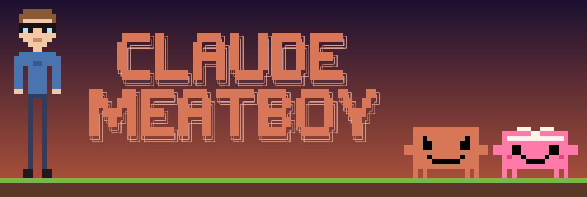
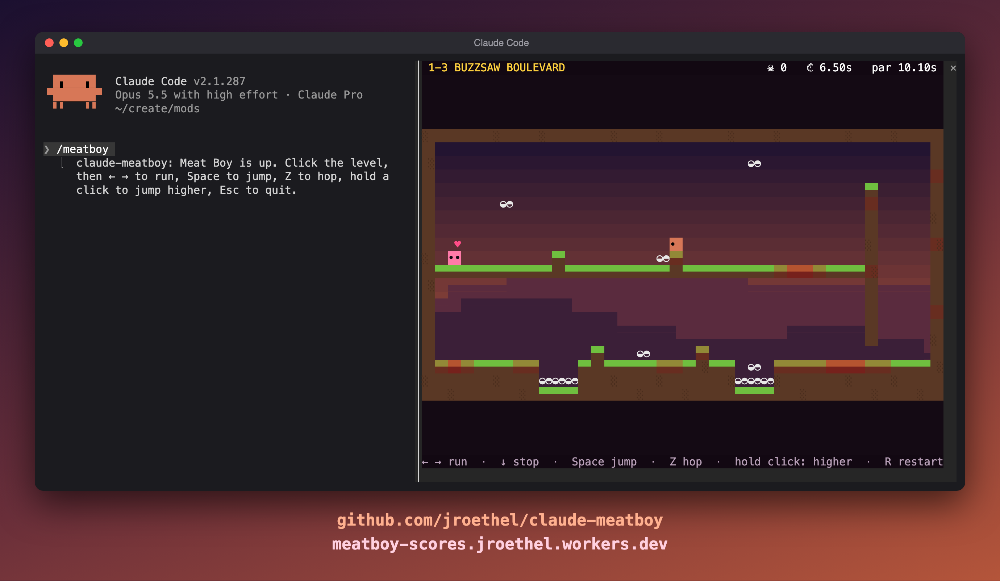

# Claude Meatboy

A silly tribute game playable in Claude as Clawd\
by JR is Tall ([github.com/jroethel](https://github.com/jroethel)&nbsp;&nbsp;x: [@jeremyroethel](https://x.com/jeremyroethel))

Global Leaderboard at [meatboy-scores.jroethel.workers.dev](https://meatboy-scores.jroethel.workers.dev)



A playable Super Meat Boy tribute inside Claude Code, starring Clawd as Meat Boy.
Chapter 1 has 6 levels, played in a pane, with saws, wall-jumps, crumbling blocks, meat smears, Dr. Fetus, and the all-attempts replay.
Chapter 2 is on the way.
Finish a run and it goes on a world scoreboard under your X handle.



## Play

```
git clone https://github.com/jroethel/claude-meatboy
claude --plugin-dir ./claude-meatboy
```

Then run `/meatboy` and click the level once so it takes the keys.
The levels are up to 30 rows tall, which fits in a wide terminal's side panel.
In a narrow terminal the pane opens above the prompt at a third of the height, and the map scrolls with Meat Boy.

| Key            | Does                                                     |
|----------------|----------------------------------------------------------|
| ← →            | Turn. Meat Boy auto-runs, since terminals have no key-up |
| ↓              | Stop                                                     |
| Space or ↑     | Full jump                                                |
| Z              | Short hop                                                |
| Click and hold | Jump, higher the longer you hold                         |
| R              | Restart the level                                        |
| 1 to 6         | Pick an open level. Any but 1 is practice                |
| M              | Cycle soundtrack A, B and off                            |
| Esc            | Close the pane                                           |

Running without stopping, turning or hitting a wall builds speed for about a second.
Jump while sliding down a wall to wall-jump.
Practice runs show PRACTICE in place of the timer and save nothing.

`/meatboy scores` prints the world top ten, `/meatboy music a`, `b` or `off` picks a soundtrack, and `/meatboy mute` silences everything.

## The world board

A run from 1-1 through 1-6 in order, outside practice, ends by asking for your X handle, up to 15 letters, digits or underscores.
The game sends the handle, the time, the death count and each level's winning inputs to a Cloudflare Worker.
The Worker replays every level on the game's own physics and stores the time the replay gives, so a run can't be faked by editing its time.
Deaths are taken as sent and only break ties.
Handles are not checked against X, so anyone can type any handle.
Offline, the run stays on your machine's board, and `/meatboy scores` says so.
Sessions with `CLAUDE_CODE_DISABLE_NONESSENTIAL_TRAFFIC` set count as offline, because Claude Code then refuses a plugin's network requests.

## Develop

```
claude plugin test ./claude-meatboy
```

The tests play every level through its winning script in `tests/solutions.ts`, drive the pane, and check that the verifier accepts real runs and rejects edited ones.
The physics in `hooks/game.ts` are pure and deterministic, and `hooks/screen.ts` draws them on the engine's frame clock.
Type checking needs the Claude Code types that the plugin-authoring skill writes to `.claude-plugin/types/`, which are not in this repo.

The Worker is in `scoreboard/` and imports `hooks/verify.ts`, so any change to the physics, the levels or the verifier means redeploying it:

```
cd scoreboard && npx wrangler deploy
```

## Credits

A fan tribute to Super Meat Boy by Team Meat, not affiliated with or endorsed by them.
Clawd is the mascot from Claude Code's banner.
